# ProductCatalog with ABP FusionCache & .NET Aspire

A comprehensive sample demonstrating **ABP FusionCache** integration with **.NET Aspire** orchestration in a realistic multi-service architecture.

## 🎯 What This Sample Demonstrates

This sample showcases a **Product Catalog System** with two services:

1. **Public API** (read-heavy) - Serves product data with aggressive caching
2. **Admin Portal** (write-heavy) - Manages products with cache invalidation

### Key Features Demonstrated

- [x] **Hybrid L1/L2 Caching** - Memory + Redis for optimal performance
- [x] **Redis Backplane** - Cache synchronization across multiple services
- [x] **Fail-Safe Mode** - Continues serving stale data when Redis is unavailable
- [x] **Cache Stampede Protection** - Prevents database overload on cache misses
- [x] **Multi-Tenancy** - Automatic tenant-aware cache isolation
- [x] **Aspire Orchestration** - Seamless local development with containers
- [x] **Health Checks & Telemetry** - Full observability via Aspire dashboard

---

## 🏗️ Architecture

```mermaid
graph TD
    A[".NET Aspire AppHost"] --> B["Public API"]
    A --> C["Admin Portal"]
    A --> D["Redis"]
    B -- "◄──►" --> C
    B -- "◄──►" --> D
    C -- "◄──►" --> D
    B --> E["PostgreSQL Database"]
    C --> E
```



### Data Flow

1. **Admin creates/updates product** → Database → Invalidates cache
2. **Redis backplane broadcasts** invalidation to all instances
3. **API's L1 cache syncs** automatically via backplane
4. **Next API request** fetches fresh data → caches it
5. **Subsequent requests** served from ultra-fast L1 memory

---

## 🚀 Getting Started

### Prerequisites

- **.NET 9.0 SDK** or later
- **Docker Desktop** (for Redis & PostgreSQL containers)
- **(Optional)** Visual Studio 2022 or JetBrains Rider

### Quick Start

1. **Clone the repository**
   ```bash
   git clone https://github.com/Clinical-Support-Systems/abp-fusioncache.git
   cd abp-fusioncache/samples/ProductCatalog.Aspire
   ```

2. **Restore dependencies**
   ```bash
   dotnet restore
   ```

3. **Run the Aspire AppHost**
   ```bash
   cd ProductCatalog.AppHost
   dotnet run
   ```

4. **Open the Aspire Dashboard** (automatically launches)
   - Default URL: `http://localhost:15000`
   - View all services, logs, metrics, and traces

5. **Access the applications**
   - **API Swagger UI**: `http://localhost:5100` or `https://localhost:7100`
   - **Admin Portal**: `http://localhost:5200` or `https://localhost:7200`
   - **Redis Commander**: Available via Aspire dashboard
   - **pgAdmin**: Available via Aspire dashboard

---

## 📋 Project Structure

```
ProductCatalog.Aspire/
├── ProductCatalog.AppHost/              # Aspire orchestration
│   └── Program.cs                       # Service configuration
│
├── ProductCatalog.ServiceDefaults/      # Shared Aspire config
│   └── Extensions.cs                    # Health checks, telemetry
│
├── ProductCatalog.Shared/               # Domain layer
│   ├── Entities/
│   │   └── Product.cs                   # Product entity
│   ├── Dtos/
│   │   ├── ProductDto.cs
│   │   └── CreateUpdateProductDto.cs
│   └── ProductCatalogSharedModule.cs    # ABP module
│
├── ProductCatalog.Infrastructure/       # Data layer
│   ├── EntityFramework/
│   │   └── ProductDbContext.cs          # EF Core DbContext
│   └── ProductCatalogInfrastructureModule.cs
│
├── ProductCatalog.Api/                  # Public API (read-heavy)
│   ├── Controllers/
│   │   └── ProductsController.cs        # REST endpoints
│   ├── Services/
│   │   └── ProductService.cs            # Cached product queries
│   ├── ProductCatalogApiModule.cs       # ABP + FusionCache config
│   └── Program.cs                       # Aspire integration
│
├── ProductCatalog.Admin/                # Admin Portal (write-heavy)
│   ├── Controllers/
│   │   └── ProductsController.cs        # CRUD operations
│   ├── Services/
│   │   └── ProductAdminService.cs       # Cache invalidation
│   ├── Views/Products/
│   │   ├── Index.cshtml
│   │   ├── Create.cshtml
│   │   └── Edit.cshtml
│   ├── ProductCatalogAdminModule.cs
│   └── Program.cs
│
└── ProductCatalog.sln
```

---

## 🧪 Testing Cache Features

### 1. Cache Hit/Miss Behavior

**Test L1 Memory Cache:**
```bash
# Call API endpoint multiple times
curl http://localhost:5100/api/products/1
curl http://localhost:5100/api/products/1  # Should be instant (L1 hit)
```

**Check logs:**
- First request: `Cache MISS for product 1 - fetching from database`
- Second request: `Cache HIT for product 1`

---

### 2. Redis Backplane Synchronization

**Test multi-service cache sync:**

1. **Get product from API** (caches it)
   ```bash
   curl http://localhost:5100/api/products/1
   ```

2. **Update product in Admin Portal**
   - Navigate to `http://localhost:5200`
   - Edit product #1
   - Click "Update Product"

3. **Get product from API again**
   ```bash
   curl http://localhost:5100/api/products/1
   ```
   - Should see **fresh data** (cache was invalidated via backplane)

**What happened:**
- Admin invalidated cache → Redis backplane broadcast → API's L1 cache synced → Fresh data fetched

---

### 3. Fail-Safe Mode (Redis Down)

**Test resilience when Redis fails:**

1. **Get product** (caches it)
   ```bash
   curl http://localhost:5100/api/products/1
   ```

2. **Stop Redis container** via Aspire dashboard
   - Click "Stop" on the Redis container

3. **Get product again**
   ```bash
   curl http://localhost:5100/api/products/1
   ```
   - Still works! Serves **stale data** from L1 cache
   - Check logs: `[Fail-Safe] Serving stale cache entry`

4. **Restart Redis**
   - Cache synchronization resumes automatically

---

### 4. Cache Stampede Protection

**Test concurrent requests:**

```bash
# Send 100 concurrent requests for uncached product
for i in {1..100}; do
  curl http://localhost:5100/api/products/999 &
done
wait
```

**Check logs:**
- Only **1 database query** executed
- Other requests waited on the cache lock
- All requests received the same cached result

---

### 5. Multi-Tenancy Isolation

**Test tenant-aware caching:**

```bash
# Request as Tenant 1
curl -H "X-Tenant-Id: 1" http://localhost:5100/api/products

# Request as Tenant 2
curl -H "X-Tenant-Id: 2" http://localhost:5100/api/products

# Different cache keys, isolated data
```

**Cache keys generated:**
- Tenant 1: `ProductCatalog:tenant:1:all-products-active`
- Tenant 2: `ProductCatalog:tenant:2:all-products-active`

---

## 📊 Observability

### Aspire Dashboard

Access at `http://localhost:15000` to monitor:

- **Services**: Health status, endpoints, environment variables
- **Logs**: Structured logs from all services
- **Traces**: Distributed tracing with OpenTelemetry
- **Metrics**: Request rates, cache hit ratios, database queries
- **Containers**: Redis, PostgreSQL status and resource usage

### FusionCache Metrics

Watch logs for cache telemetry:
```
[FusionCache] Cache HIT for key: product:123 (L1)
[FusionCache] Cache MISS for key: product:456 - factory executed
[FusionCache] Backplane notification received: product:123 invalidated
[FusionCache] Fail-Safe activated - serving stale data
```

### Health Checks

- **API**: `http://localhost:5100/health`
- **Admin**: `http://localhost:5200/health`

---

## 🎛️ Configuration

### FusionCache Options

Configure in `ProductCatalogApiModule.cs` and `ProductCatalogAdminModule.cs`:

```csharp
Configuration.Caching.UseFusionCache(options =>
{
    options.DefaultCacheDuration = TimeSpan.FromMinutes(10);
    options.EnableDistributedCache = true;       // L2 Redis cache
    options.EnableBackplane = true;              // Multi-service sync
    options.EnableFailSafe = true;               // Resilience mode
    options.EnableCacheStampedeProtection = true; // Concurrent safety
    options.EnableMultiTenancy = true;           // Tenant isolation
    options.EnableEagerRefresh = false;          // Proactive refresh
    options.EagerRefreshThreshold = 0.9f;        // 90% threshold
    options.KeyPrefix = "ProductCatalog";        // Cache key prefix
});
```

### Redis Configuration

```csharp
services.AddAbpFusionCacheRedis(Configuration, options =>
{
    // Connection string auto-injected by Aspire
    options.EnableBackplane = true;
    options.InstanceName = "ProductCatalog:";
});
```

### Multi-Tenancy Behavior

When `EnableMultiTenancy = true`:
- **Tenant data**: Cache duration = 75% of default (fresher data)
- **Host data**: Cache duration = 150% of default (longer-lived)
- **Fail-safe window**: 1 hour for tenant, 4 hours for host

---

## 🔍 Sample API Endpoints

### Public API (Port 5100/7100)

| Method | Endpoint | Description |
|--------|----------|-------------|
| GET | `/api/products` | Get all active products (cached) |
| GET | `/api/products/{id}` | Get product by ID (cached) |
| GET | `/api/products/category/{category}` | Get products by category (cached) |
| GET | `/api/products/search?q={term}` | Search products (not cached) |
| GET | `/health` | Health check |

### Admin Portal (Port 5200/7200)

| Method | Path | Description |
|--------|------|-------------|
| GET | `/Products` | List all products |
| GET | `/Products/Create` | Create product form |
| POST | `/Products/Create` | Create product (invalidates cache) |
| GET | `/Products/Edit/{id}` | Edit product form |
| POST | `/Products/Edit/{id}` | Update product (invalidates cache) |
| POST | `/Products/Delete/{id}` | Delete product (invalidates cache) |

---

## 🛠️ Development Tips

### Running Individual Services

Instead of Aspire, you can run services individually:

```bash
# Terminal 1: Start Redis
docker run -p 6379:6379 redis:latest

# Terminal 2: Start PostgreSQL
docker run -p 5432:5432 -e POSTGRES_PASSWORD=postgres postgres:16

# Terminal 3: Run API
cd ProductCatalog.Api
dotnet run

# Terminal 4: Run Admin
cd ProductCatalog.Admin
dotnet run
```

### Debugging

1. Set breakpoints in `ProductService.cs` or `ProductAdminService.cs`
2. Run AppHost in debug mode
3. Attach debugger to API/Admin process via Aspire dashboard

### Cache Inspection

Use **Redis Commander** (included via Aspire):
1. Open Aspire dashboard
2. Click Redis container → "Open Redis Commander"
3. Browse cache keys: `ProductCatalog:*`

---

## 📚 Learning Resources

### FusionCache Documentation
- [FusionCache GitHub](https://github.com/ZiggyCreatures/FusionCache)
- [FusionCache Docs](https://github.com/ZiggyCreatures/FusionCache/blob/main/docs/README.md)

### ABP Framework
- [ABP Documentation](https://docs.abp.io/)
- [ABP Caching](https://docs.abp.io/en/abp/latest/Caching)

### .NET Aspire
- [Aspire Documentation](https://learn.microsoft.com/en-us/dotnet/aspire/)
- [Aspire Redis Integration](https://learn.microsoft.com/en-us/dotnet/aspire/caching/stackexchange-redis-integration)

---

## 🐛 Troubleshooting

### Redis Connection Issues

**Error:** `Unable to connect to Redis`

**Solution:**
- Ensure Docker Desktop is running
- Check Aspire dashboard for Redis container status
- Verify Redis port 6379 is not in use

### Database Migration Errors

**Error:** `Cannot connect to PostgreSQL`

**Solution:**
- Check Aspire dashboard for PostgreSQL container status
- Database is auto-created on startup via `EnsureCreatedAsync()`

### Cache Not Synchronizing

**Issue:** Admin changes not reflected in API

**Solution:**
- Verify `EnableBackplane = true` in both services
- Check Redis logs for backplane messages
- Ensure both services use same `KeyPrefix`

### Aspire Dashboard Not Opening

**Solution:**
```bash
# Manually open dashboard
dotnet run --project ProductCatalog.AppHost --launch-profile http
# Navigate to http://localhost:15000
```

---

## 🎯 Next Steps

**Experiment with:**
- [ ] Add more cache scenarios (search results, aggregations)
- [ ] Implement eager refresh for critical data
- [ ] Add cache metrics endpoint
- [ ] Test with multiple replicas (scale API to 3 instances)
- [ ] Add integration tests with Testcontainers
- [ ] Deploy to Azure Container Apps using Aspire

---

## 📝 License

This sample is part of the ABP FusionCache project and is licensed under the MIT License.

---

## 🤝 Contributing

Found an issue or have improvements? Open an issue or PR at:
https://github.com/Clinical-Support-Systems/abp-fusioncache

---

**Happy Caching! 🚀**
